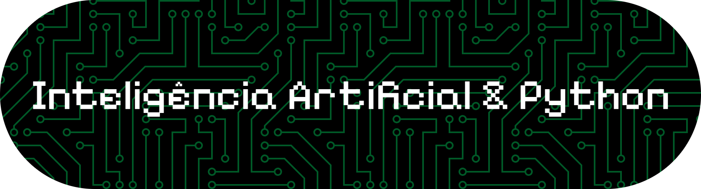
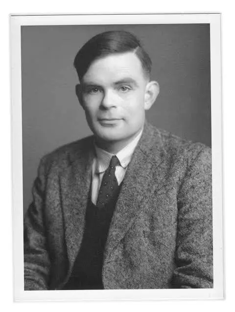

<header> 
 </br>
<h1 align="center"> História da Inteligência Artificial  </h1>
<h1 align="center"> 
<p> Alan Turing </p>


#### Alan Turing foi um matemático, lógico e criptoanalista britânico, considerado o pai da computação e um dos fundadores da inteligência artificial.

# Principais feitos:

#### Máquina de Turing (1936): Criou um modelo abstrato que define os fundamentos lógicos dos computadores modernos. Todo computador hoje é, essencialmente, uma "Máquina de Turing universal".

#### Decifrando o Enigma (1939-1945): Durante a Segunda Guerra, liderou a equipe que quebrou o código da máquina alemã Enigma.<br/>

#### Seu trabalho foi crucial para a vitória dos Aliados, encurtando a guerra e salvando milhões de vidas.Teste de Turing (1950): Propôs um teste para medir a inteligência de uma máquina: se ela pudesse conversar como um humano, seria considerada "inteligente". Essa ideia ainda é debatida hoje no campo da IA.

# Sua vida:

#### Turing era um homem à frente de seu tempo, mas também solitário e excêntrico. Em 1952, foi condenado por homossexualidade e submetido a castração química, o que o levou à depressão. Morreu em 1954, aparentemente por suicídio. Em 2009, o governo britânico pediu desculpas públicas, e em 2013 recebeu perdão real.

# Legado:

#### Sua visão de máquinas que pensam lançou as bases para toda a ciência da computação e para a inteligência artificial que exploramos hoje.

</p>

<h1 align="center"> 

# As Primeiras Máquinas


</h1>
<p> 

# Assembly 1950
- Logo após Turing, os computadores eram programados em linguagem de máquina ou assembly. O código era específico para cada máquina.
- Programa em Assembly Simulado

```assembly
; Programa simples: somar dois números
; Estilo PDP-8 assembly
        CLA         ; Limpa acumulador
        TAD A       ; Soma valor de A
        TAD B       ; Soma valor de B
        DCA C       ; Armazena em C
        HLT         ; Para execução
A,      5           ; Dado A
B,      3           ; Dado B
C,      0           ; Resultado
```

# Fortran (1957)

- A primeira linguagem de alto nível, criada por John Backus na IBM. Revolucionou a programação científica.

- Cálculo de média em Fortran

```fortran
C       PROGRAMA PARA CALCULAR MÉDIA
        PROGRAM MEDIA
        REAL A, B, C, MEDIA
        
        READ(*,*) A, B, C
        MEDIA = (A + B + C) / 3.0
        WRITE(*,*) 'A média é:', MEDIA
        
        STOP
        END
```

# LISP (1958/1960)
- Criada por John McCarthy, foi a linguagem escolhida para as primeiras pesquisas em IA. Baseada em listas e funções.
- Função simples em LISP

```lisp
;; Definindo uma função para calcular fatorial
(defun fatorial (n)
  (if (<= n 1)
      1
      (* n (fatorial (- n 1)))))

;; Testando
(print (fatorial 5))  ; Retorna 120

;; Programa clássico de IA: busca em profundidade
(defun busca-profundidade (no objetivo)
  (cond ((equal no objetivo) (list no))
        ((null (filhos no)) nil)
        (t (some #'(lambda (filho)
                     (cons no (busca-profundidade filho objetivo)))
                 (filhos no)))))
```
# PROLOG (1972)
- Linguagem lógica criada na França, base para sistemas especialistas e IA simbólica.
- Programa PROLOG (Relações familiares)

```prolog
% Fatos
pai(jose, joao).
pai(jose, maria).
pai(joao, ana).
pai(joao, pedro).

mae(maria, carla).

% Regras
avo(X, Y) :- pai(X, Z), pai(Z, Y).
avo(X, Y) :- pai(X, Z), mae(Z, Y).

irmaos(X, Y) :- pai(P, X), pai(P, Y), X \= Y.

% Consultas
% ?- avo(jose, ana).     (true)
% ?- irmaos(joao, maria). (true)
```

# C e Sistemas Especialistas 1980
- A linguagem C dominava, e os sistemas especialistas (baseados em regras) eram o estado da arte em IA.
- Pequeno sistema especialista em C
```C
#include <stdio.h>
#include <string.h>

// Simples sistema especialista para diagnóstico
int main() {
    char febre, tosse, dor_cabeca;
    
    printf("=== Sistema Especialista de Diagnóstico ===\n");
    printf("Você tem febre? (s/n): ");
    scanf(" %c", &febre);
    printf("Você tem tosse? (s/n): ");
    scanf(" %c", &tosse);
    printf("Você tem dor de cabeça? (s/n): ");
    scanf(" %c", &dor_cabeca);
    
    // Regras de diagnóstico
    if (febre == 's' && tosse == 's' && dor_cabeca == 's') {
        printf("\nDiagnóstico: Possível Gripe\n");
        printf("Recomendação: Descanse e beba bastante água\n");
    }
    else if (febre == 's' && tosse == 's') {
        printf("\nDiagnóstico: Possível Resfriado\n");
        printf("Recomendação: Antitérmico e repouso\n");
    }
    else if (febre == 's' && dor_cabeca == 's') {
        printf("\nDiagnóstico: Possível Enxaqueca\n");
        printf("Recomendação: Consulte um médico\n");
    }
    else {
        printf("\nDiagnóstico: Sintomas leves\n");
        printf("Recomendação: Observe por 24 horas\n");
    }
    
    return 0;
}
```

# Python e Machine Learning 1990
- Python começa a ganhar espaço, e com ele bibliotecas para IA.
- Rede neural simples em Python 
```python
# Rede neural simples sem bibliotecas (como se fazia nos anos 90)

import math
import random

class Neuronio:
    def __init__(self, n_entradas):
        self.pesos = [random.random() - 0.5 for _ in range(n_entradas)]
        self.bias = random.random() - 0.5
    
    def ativacao(self, x):
        # Função sigmoide
        return 1 / (1 + math.exp(-x))
    
    def forward(self, entradas):
        soma = self.bias
        for i in range(len(entradas)):
            soma += entradas[i] * self.pesos[i]
        return self.ativacao(soma)

# Testando
neuronio = Neuronio(2)
entrada = [0.5, 0.3]
saida = neuronio.forward(entrada)
print(f"Saída do neurônio: {saida:.4f}")
```

<p align="center">

| Década | Linguagem | 	Principal Contribuição para IA |
| :---: | :---: | :---: |
| 1950s | Assembly/Fortran | Primeiros programas, computação científica |
| 1960s | LISP | IA simbólica, processamento de listas |
| 1970s | 	PROLOG | Programação lógica, sistemas especialistas |      
| 1980s | 	C/C++ | Sistemas especialistas comerciais |
| 1990s | Python/Java | Machine Learning começa a florescer  |
| 2000s | Python/TensorFlow | Deep Learning e IA moderna |

</p>


</p>


</h1>
